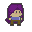
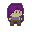
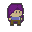
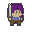
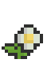
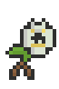
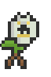
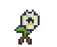

# 🕹️ Proyecto Final de Animación – Unity 2D Pixel Art  
### *Opción Máxima — Integración de animaciones en entorno interactivo*

---

## 📘 Introducción  

Este proyecto fue desarrollado en **Unity 2022.4.2f1** como parte de la materia **Animación de Videojuegos**.  
El objetivo principal es **integrar animaciones originales dentro de un entorno interactivo**, donde las acciones de los personajes respondan a eventos del juego y entradas del usuario.

El proyecto incluye **dos personajes completamente animados cuadro por cuadro en pixel art**:

| Personaje | Tipo | Control |
|----------|------|---------|
| **Mia** | Protagonista | Jugador |
| **Flor** | Enemigo | IA (FSM + colliders y triggers) |

Ambos aplican principios clásicos de animación adaptados al pixel art y a mecánicas de gameplay 2D.

---

## 🎨 Herramientas utilizadas  

| Área | Software |
|------|----------|
| Pixel Art y Animación | Aseprite |
| Motor de juego | Unity 2022.4.2f1 |
| Scripting | C# + Visual Studio Code |

---

# 🧩 Personajes & Animaciones

---

## 🟣 Mia — Personaje Jugable

🖼️ **Vista previa de animaciones**  

| Animación | Función | Preview |
|----------|---------|---------------------|
| Idle | Reposo con micro-movimiento |  |
| Walk/Run | Movimiento horizontal |  |
| Jump | Salto con caída |  |
| Attack | Ataque cuerpo a cuerpo | |

---

## 🌼 Flor — Enemigo (IA)

🖼️ **Vista previa de animaciones**  

| Animación | Activación | Preview |
|----------|------------|--------------------|
| Idle | Estado base ||
| Detect | Entra jugador en rango | .gif) |
| Run | Persigue a Mia |  |
| Attack | Golpea al jugador |  |
| Hit | Recibe daño |  |
|  Death | Muere con fade-out |  |

> 🔹 La UI de vida de *Flor* aparece solo cuando detecta a Mia.

---

# ⚙️ Implementación en Unity

## 🔁 Animators y FSM (Máquinas de Estado)

Cada personaje posee su propio **Animator Controller**, conectado a scripts C# que controlan estados como:

- Movimiento
- Ataque
- Daño
- Muerte
- Transiciones condicionales
- Colliders tipo Trigger para detección y combate

---

## 🎯 Mecánicas principales

| Mecánica | Implementación |
|---------|---------------|
| Ataque de Mia | Hitbox activado por AnimationEvent |
| Daño a Flor | Detecta colisión con hitbox |
| Vida de ambos personajes | UI en corazones actualizada en tiempo real |
| IA de Flor | Detección → persecución → ataque con cooldown |
| Muerte | Animación + fade out + destroy |

